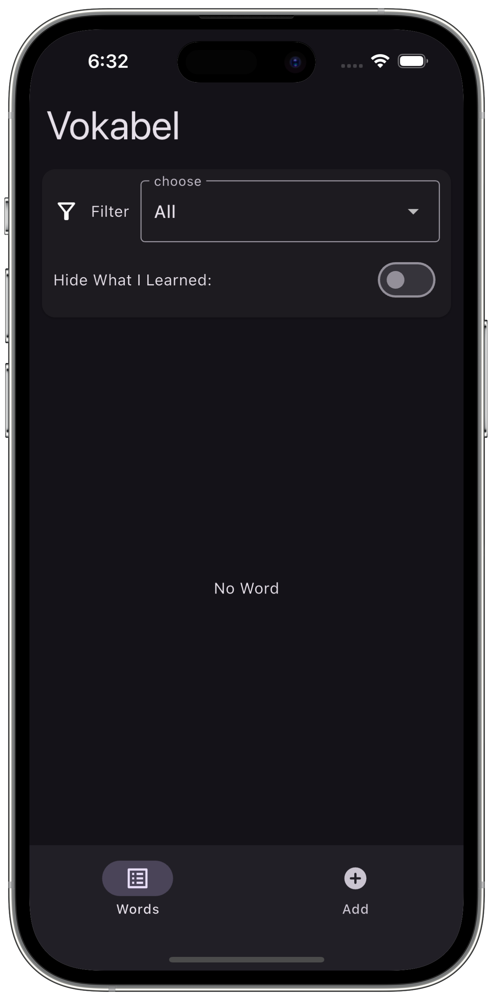
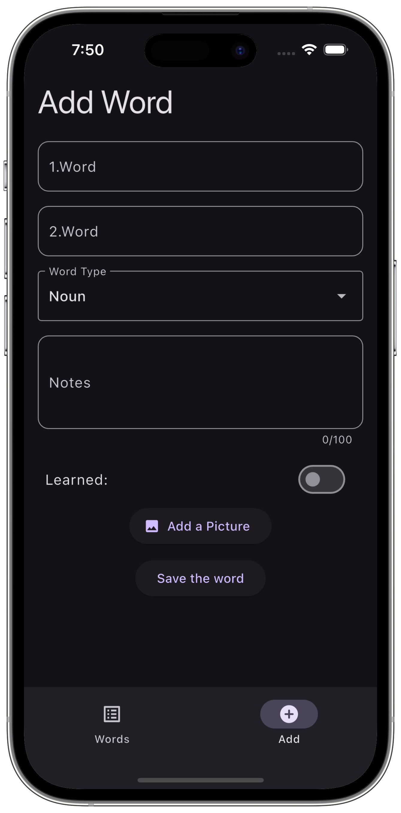
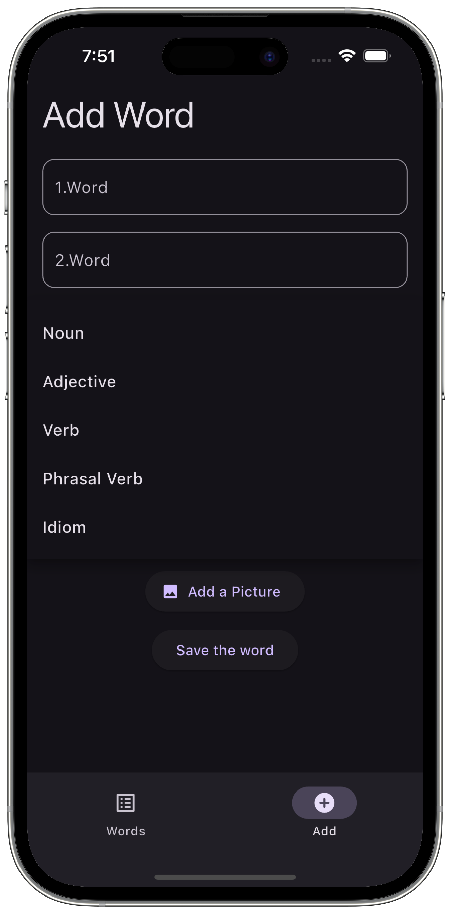
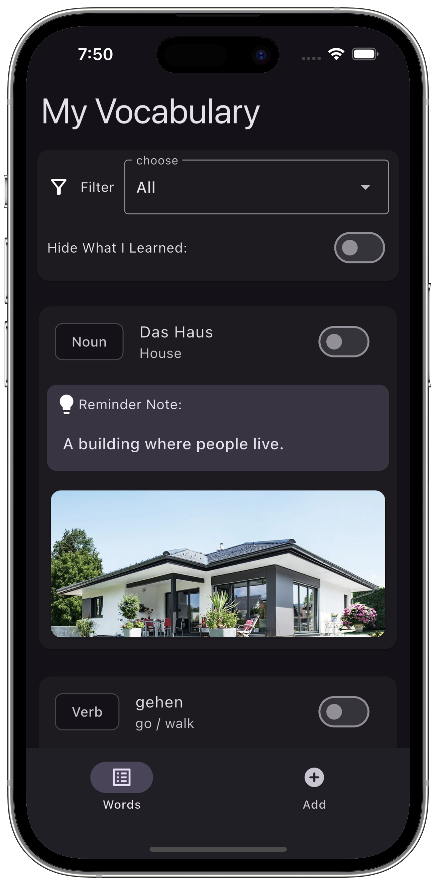
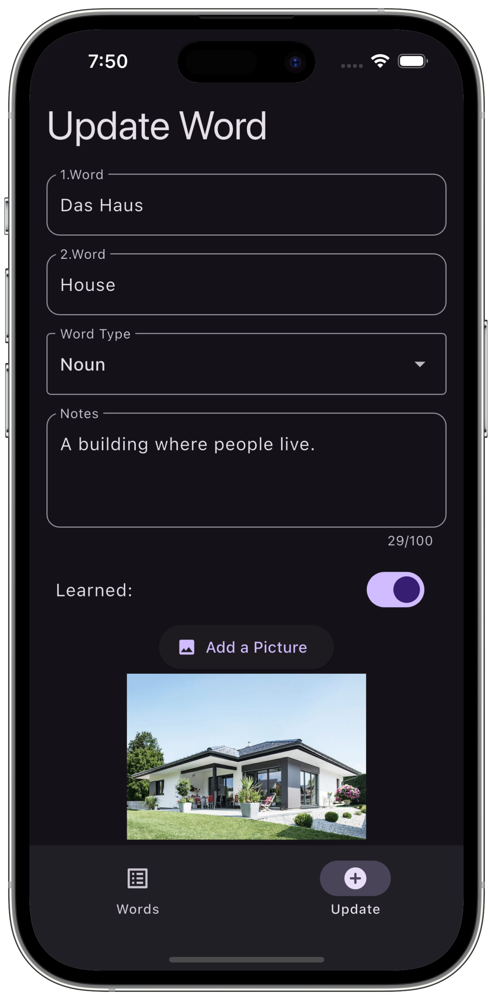

# My Vocabulary App
My Vocabulary is a Flutter-based vocabulary learning app that helps users store and review word pairs in any two languages. Whether you're learning English–German, Turkish–French, or any other language combination, this app is designed to support your personalized language journey.
This app uses Isar – a high-performance, offline-first NoSQL database for Flutter – to store vocabulary entries locally on the device.

# Features
- Save vocabulary pairs in any two languages
- Add example sentences or mnemonic stories
- Add optional images to associate words visually
- Organize words by type: noun, verb, adjective, idiom, etc.
- Mark words as “learned”
- Filter by word type or hide learned words
- Update or delete entries anytime
- Beautiful and user-friendly Flutter UI

# Screenshorts

 
  

A few resources to get you started if this is your first Flutter project:

- [Lab: Write your first Flutter app](https://docs.flutter.dev/get-started/codelab)
- [Cookbook: Useful Flutter samples](https://docs.flutter.dev/cookbook)

For help getting started with Flutter development, view the
[online documentation](https://docs.flutter.dev/), which offers tutorials,
samples, guidance on mobile development, and a full API reference.
